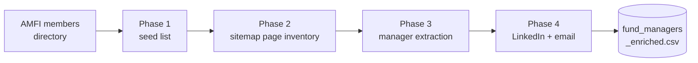

<div align="center">

# MF-Engine

**A four-stage pipeline that turns India's mutual-fund industry into a structured fund-manager dataset.**

From the AMFI members directory to a clean CSV of who manages the money — names, roles, locations, and LinkedIn profiles — for every SEBI-registered Asset Management Company.

[](LICENSE)
[](https://www.python.org/)
[](https://github.com/unclecode/crawl4ai)
[](https://docs.docker.com/compose/)
[](#roadmap)

</div>

---

## What it does

Indian Asset Management Companies (AMCs) publish who runs their funds — but scattered across ~55 corporate websites, each with a different layout, most behind bot protection. MF-Engine walks the chain automatically:

1. **Discovers** every active AMC from AMFI, the industry's source of truth, with its official corporate domain.
2. **Maps** each site to the pages that actually matter — team directories and fund/scheme pages — straight from the site's own sitemap. No URLs are ever guessed.
3. **Extracts** fund-manager records (name, designation, location, email) into a CSV.
4. **Enriches** each manager with a name-matched LinkedIn profile URL.

The result is [`data/fund_managers.csv`](data) — a dataset you can't buy off the shelf, built entirely from public sources.



## Highlights

- **Source of truth, not guesswork.** Seeds from AMFI's hydration payload — stable IDs, registered legal names, and each AMC's *official* website. Domains are read, never slugged together.
- **Never fabricates a URL.** Every page crawled is one the site itself published (sitemap `<loc>`, on-page anchors), followed through redirects to its real destination. Pattern-matching only *classifies* discovered URLs; it never *constructs* them.
- **Gets past the walls.** Stealth headless Chromium, `www.`-variant retries, soft-200 challenge detection, and per-site canonical-host resolution unlock WAF-protected AMCs (HDFC, ICICI, UTI, Franklin…).
- **Degrades safely.** Live scrape unusable? Fall back to an embedded roster. Search returns junk? A name-match guard rejects it — a wrong LinkedIn URL never lands in the data.
- **Batteries-included stack.** A single `docker compose` brings up MinIO, a local Qwen LLM (vLLM), Open WebUI, Qdrant, and SearXNG.

## Pipeline

| Phase | Script | Output | What it does | Status |
|:-----:|--------|--------|--------------|:------:|
| **1** | [`main.py`](main.py) | `amc_seed_list.json` | Scrape AMFI → **55 AMCs** with official domains & verified sitemaps | ✅ |
| **2** | [`phase2_discover.py`](phase2_discover.py) | `amc_page_inventory.json` | Classify sitemap URLs → team + scheme pages (**40 AMCs, 7,372 scheme URLs**) | ✅ |
| **3** | [`phase3_extract.py`](phase3_extract.py) | `fund_managers.csv` | Extract **137 managers** — name, designation, email, location | ✅ |
| **4** | [`phase4_enrich.py`](phase4_enrich.py) | `fund_managers_enriched.csv` | Name-matched LinkedIn URL + best-effort email | ✅ |
| 5 | — | MinIO buckets | Persist raw HTML + JSON, date-partitioned | 📋 planned |
| 6 | — | Qdrant | Semantic search over manager profiles | 📋 planned |

## Quickstart

```bash
# 1. Install
pip install -r requirements.txt
playwright install chromium          # one-time browser download

# 2. Run the pipeline
python main.py                       # Phase 1 → data/amc_seed_list.json
python phase2_discover.py            # Phase 2 → data/amc_page_inventory.json
python phase3_extract.py             # Phase 3 → data/fund_managers.csv
python phase4_enrich.py              # Phase 4 → data/fund_managers_enriched.csv
```

Phase 4's LinkedIn search needs a backend — set `BRAVE_API_KEY` (reliable) or point `SEARXNG_URL` at a local SearXNG (no key, best-effort). See [Configuration](#configuration).

### With Docker

```bash
docker build -t mf-engine .
docker run -v ./data:/app/data mf-engine          # runs Phase 1

# Full supporting stack (MinIO, vLLM/Qwen, Open WebUI, Qdrant, SearXNG, Tor):
cd docker && cp .env.example .env
docker compose up -d
```

## Output

`fund_managers_enriched.csv` — one row per (AMC, manager):

| Column | Example |
|--------|---------|
| `firm_name` | `Aditya Birla Sun Life Mutual Fund` |
| `manager_name` | `Harish Krishnan` |
| `designation` | `Chief Investment Officer` |
| `location` | `Mumbai` |
| `email` | verified only (AMC page / Hunter / SMTP), else blank |
| `email_guess` | `harish.krishnan@…` — a pattern guess, never asserted as fact |
| `linkedin_url` | `https://www.linkedin.com/in/harish-krishnan-cfa-38402950/` |

Full field semantics for every stage: [context/data-schema.md](context/data-schema.md).

## Configuration

Phase 4 is driven by environment variables (all optional):

| Variable | Purpose |
|----------|---------|
| `BRAVE_API_KEY` | Brave Search API for LinkedIn discovery — reliable, recommended |
| `SEARXNG_URL` | Self-hosted SearXNG fallback (default `http://localhost:8080`) |
| `HUNTER_API_KEY` | Hunter.io email-finder for *verified* emails |
| `VERIFY_SMTP=1` | Attempt SMTP RCPT verification of guessed emails (needs `dnspython`) |
| `SEARCH_GAP_SECONDS` | Pause between live SearXNG queries (default `4`) |

Hand-verified profiles live in [`linkedin_overrides.json`](linkedin_overrides.json) (`"name|firm"` → URL) and are applied as authoritative, skipping search.

## Architecture & docs

- [context/](context/) — project overview, phase-by-phase design, data schema (read before working on pipeline logic)
- [docs/](docs/) — Mermaid flowcharts and sequence diagrams, high- and low-level
- [CLAUDE.md](CLAUDE.md) — stack, commands, and conventions

## Tech stack

`Python 3.11` · `asyncio` · [Crawl4AI](https://github.com/unclecode/crawl4ai) (Playwright/Chromium) · `BeautifulSoup` · `httpx` · Docker Compose · MinIO · vLLM + Qwen2.5 · Qdrant · SearXNG

## Roadmap

- [x] Phases 1–4: seed → discovery → extraction → enrichment
- [ ] Phase 5: MinIO persistence (dated, immutable raw-HTML + JSON archive)
- [ ] Phase 6: Qdrant semantic search + RAG over manager profiles
- [ ] LLM-assisted extraction (Qwen) to replace the Phase 3 heuristic and map managers → funds from scheme pages

## Contributing

Contributions are welcome — new AMC mappings, better parsing, a search backend, docs. Start with [CONTRIBUTING.md](CONTRIBUTING.md); it covers setup, the four project principles (chief among them: **never fabricate a URL**), the PR checklist, and how AI-assisted changes are handled. Please also read the [Code of Conduct](CODE_OF_CONDUCT.md).

- 🐛 [Report a bug](.github/ISSUE_TEMPLATE/bug_report.md) · 💡 [Request a feature](.github/ISSUE_TEMPLATE/feature_request.md) · 🔒 [Security policy](SECURITY.md)

## Disclaimer

MF-Engine collects **publicly available** information for research purposes. It reads only what sites publish (sitemaps, public pages, public search results); it does **not** scrape LinkedIn profile pages, bypass authentication, or fabricate contact data — guessed emails are clearly separated from verified ones. Respect each site's Terms of Service and applicable data-protection law when using the output.

## License

[Apache License 2.0](LICENSE) © 2026 the MF-Engine authors.
