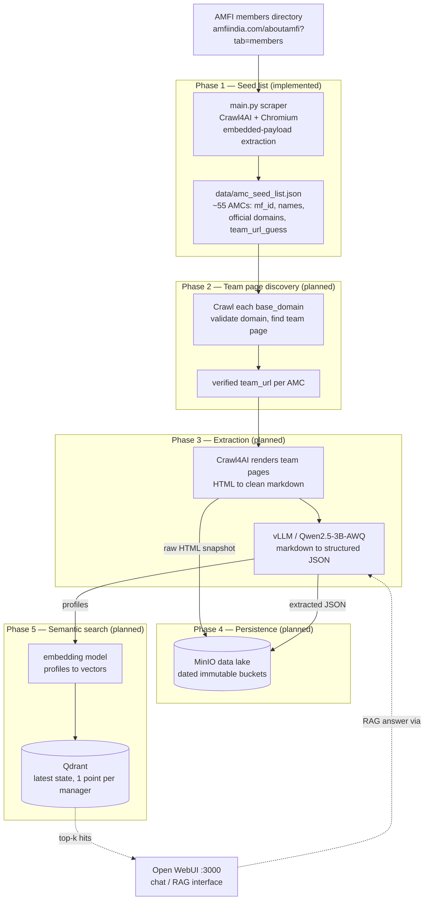
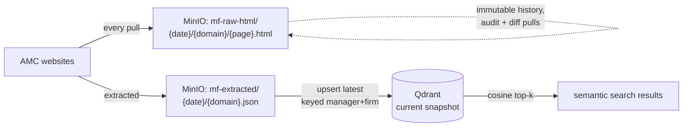

# High-Level Architecture — Flowcharts

## Full pipeline (Phases 1–5)

```mermaid
flowchart TD
    AMFI["AMFI members directory<br/>amfiindia.com/aboutamfi?tab=members"]

    subgraph PH1["Phase 1 — Seed list (implemented)"]
        SCRAPER["main.py scraper<br/>Crawl4AI + Chromium<br/>embedded-payload extraction"]
        SEED["data/amc_seed_list.json<br/>~55 AMCs: mf_id, names,<br/>official domains, team_url_guess"]
        SCRAPER --> SEED
    end

    subgraph PH2["Phase 2 — Team page discovery (planned)"]
        DISCOVER["Crawl each base_domain<br/>validate domain, find team page"]
        TEAMURLS["verified team_url per AMC"]
        DISCOVER --> TEAMURLS
    end

    subgraph PH3["Phase 3 — Extraction (planned)"]
        CRAWL["Crawl4AI renders team pages<br/>HTML to clean markdown"]
        LLM["vLLM / Qwen2.5-3B-AWQ<br/>markdown to structured JSON"]
        CRAWL --> LLM
    end

    subgraph PH4["Phase 4 — Persistence (planned)"]
        MINIO[("MinIO data lake<br/>dated immutable buckets")]
    end

    subgraph PH5["Phase 5 — Semantic search (planned)"]
        EMBED["embedding model<br/>profiles to vectors"]
        QDRANT[("Qdrant<br/>latest state, 1 point per manager")]
        EMBED --> QDRANT
    end

    UI["Open WebUI :3000<br/>chat / RAG interface"]

    AMFI --> SCRAPER
    SEED --> DISCOVER
    TEAMURLS --> CRAWL
    CRAWL -- "raw HTML snapshot" --> MINIO
    LLM -- "extracted JSON" --> MINIO
    LLM -- "profiles" --> EMBED
    QDRANT -. "top-k hits" .-> UI
    UI -. "RAG answer via" .-> LLM
```

## Data flow between stores

```mermaid
flowchart LR
    WEB["AMC websites"] -->|"every pull"| RAW["MinIO: mf-raw-html/<br/>{date}/{domain}/{page}.html"]
    WEB -->|"extracted"| EXT["MinIO: mf-extracted/<br/>{date}/{domain}.json"]
    EXT -->|"upsert latest<br/>keyed manager+firm"| QD[("Qdrant<br/>current snapshot")]
    RAW -. "immutable history,<br/>audit + diff pulls" .-> RAW
    QD -->|"cosine top-k"| SEARCH["semantic search results"]
```
