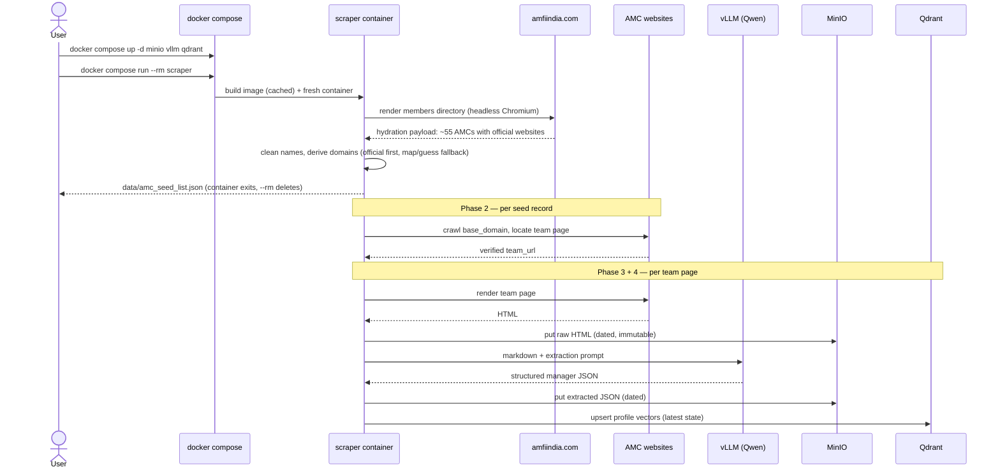

# High-Level Sequence Diagrams

## Full pipeline run (all phases, target state)



## User query via chat (Phase 5, RAG target state)

```mermaid
sequenceDiagram
    actor U as User
    participant W as Open WebUI :3000
    participant E as embedding model
    participant Q as Qdrant :6333
    participant V as vLLM / Qwen :8000

    U->>W: "small cap value manager in Chennai?"
    W->>E: embed query text
    E-->>W: query vector
    W->>Q: cosine top-k search
    Q-->>W: matching manager profiles (payloads)
    W->>V: question + retrieved profiles (RAG prompt)
    V-->>W: readable answer citing profiles
    W-->>U: answer
    Note over U,V: today only U->>W->>V plain chat works;<br/>E and Q wiring lands with Phase 5
```
